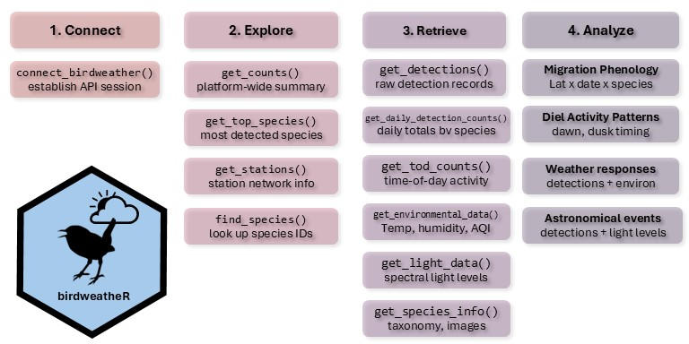
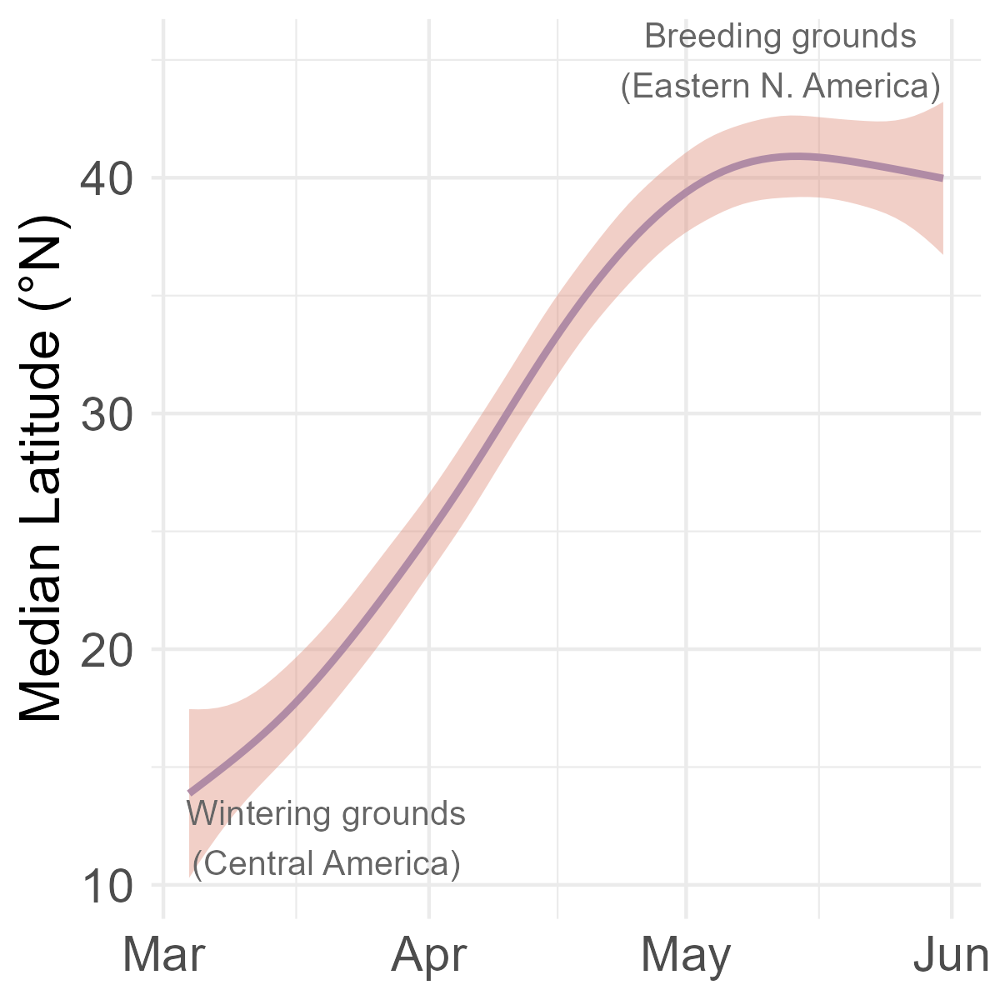
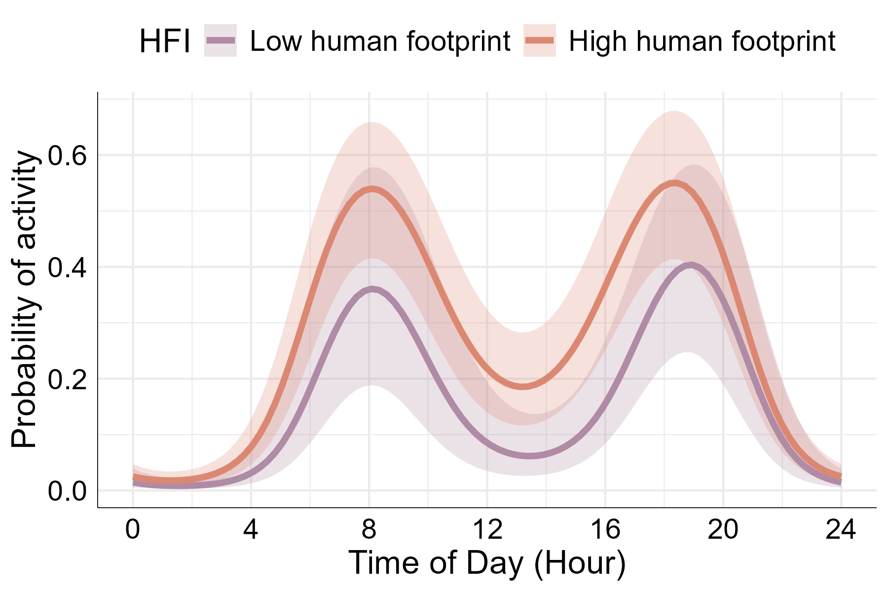
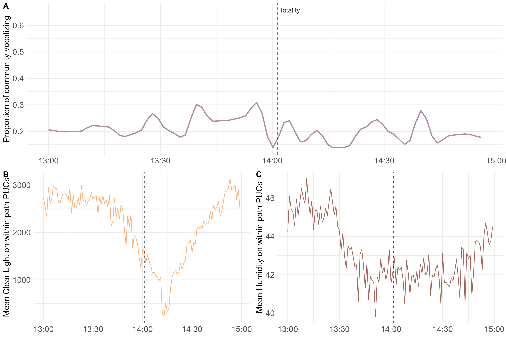

# Summary

The BirdWeather participatory science project provides a global database on
avian vocal detections paired with environmental data, enabling new lines of
research, but has been underrepresented in ecological research. We developed the
`birdweatheR` R package, a streamlined interface to the BirdWeather GraphQL API,
supporting reproducible ecological research within the R environment. We provide
three case studies demonstrating how the package facilitates access and use of
bird and environmental data for ecological analyses. BirdWeather holds
considerable promise as a data source for behavioral ecology and macroecology,
and birdweatheR will help fulfill this promise by making the database usable by
a broad community of ecologists.

# Statement of need

Passive acoustic monitoring combined with automated species identification is
emerging as a powerful tool for broadscale biodiversity monitoring [@gibb2019;
@kahl2021; @kershenbaum2025; @ross2023]. While participatory-science projects
such as eBird [@sullivan2009] have transformed our understanding of the
distribution and abundance of biodiversity, acoustic monitoring offers an
opportunity to move beyond the occurrence record and capture information on
animal behavior at unprecedented scales. Species vocalizations encode
information about behavior and environmental context, and today's autonomous
acoustic networks operate continuously, facilitating advances in biodiversity
monitoring and “macrobehavior” [@keith2023].

Established in 2021, BirdWeather [@birdweather] is a global network of
volunteer-deployed acoustic sensors with on-board species identification powered
by the BirdNET algorithm [@kahl2021]. As of early 2026, the network comprised
nearly 18,000 recording stations across six continents that collect tens of
millions of detections every month. While BirdWeather offers several recording
options, many are Portable Universe Codecs (PUCs) that simutaneously record bird
vocalization detections and temperature, humidity, barometric pressure, air
quality, and spectral light levels at high temporal resolution via onboard
sensors, enabling direct linkage of vocalization activity to local abiotic
conditions.

The scientific potential of BirdWeather is substantial. Using BirdWeather
detections, @pease2025 demonstrated that bird vocalization activity is prolonged
by nearly an hour in light-polluted areas, and @gilbert2026 used the platform to
study the impact of solar eclipses on wildlife activity. Despite this potential,
uptake among ecologists has been slow, likely due to API barriers and the
absence of an analytical pipeline in R, the primary analytical environment for
most ecologists [@lai2019]. BirdWeather currently offers three data access
modes: a graphical user interface, a REST API, and a GraphQL API—an effort in
data sharing that exceeds most comparable platforms, but one that has yet to
translate into broad scientific use. `birdweatheR` solves this gap by targeting
ecologists and ornithologists who are familiar with R but lack the programming
background to interact directly with GraphQL or REST APIs.

# State of the field

Several R packages exist for accessing biodiversity occurrence data, such as
`rebird` for eBird [@rebird] and `rgbif` for GBIF [@rgbif], or even `sppocc` for
downloading species occurrence data from several databases simultaneously
[@sppocc]. There are additionally a number of packages developed for analyzing
raw acoustic recordings, such as `warbleR` [@warbler], `monitoR` [@monitor], and
`seewave` [@seewave]. `birdweatheR` differs from the previously mentioned
packages in that it provides programmatic access to a continuously  operating
autonomous acoustic detection network that pairs species-level vocalizations
with concurrent environmental sensor readings - a combination of data currently
unavailable in R. So, although a number of packages exist for accessing
ecologically relevant biodiversity data, no database mirrors BirdWeather,
emphasizing the ecological and scientific importance of `birdweatheR`.

# Software design

`birdweatheR` is an R package that provides a streamlined interface to the
BirdWeather GraphQL API [@birdweather], enabling ecologists to access avian
vocalization detections, summarize species activity patterns, and retrieve
environmental sensor data without direct interaction with the underlying API
infrastructure (Figure 1). 
 Figure 1: Overview of the `birdweatheR`
package. The package stores an (1) API connection with no required credentials,
(2) provides platform exploration functionality, (3) enables retrieval of the
database, with (4) a number of ecological applications possible.

A single function call can retrieve thousands to millions of records and return
them as a clean, analysis-ready data frame. Package functionality spans
platform-wide and regional detection summaries (`get_counts`,
`get_top_species`), daily and time-of-day activity patterns for diel niche
analyses (`get_daily_detection_counts`, `get_tod_counts`), raw detection
downloads with flexible filtering by species, date range, and geographic
bounding box (`get_detections`), and retrieval of environmental and spectral
light sensor time series (`get_environment_data`, `get_light_data`) [Table
1](#Table-1).

 
| Function | Description |
|---|---|
| `connect_birdweather()` | Establishes a connection to the BirdWeather GraphQL API. Must be called once per session before using any other package functions. Stores the connection in a package-level environment accessible to all downstream functions. |
| `find_species()` | Searches the BirdWeather species database by common name, scientific name, or partial match (including wildcards). Returns a data.table with species IDs, common names, and scientific names. Useful for looking up species IDs to pass into other functions. |
| `get_counts()` | Returns a single-row summary of total detections, unique species, and active stations for a given time period. Supports filtering by station IDs, station types, species, and a geographic bounding box. Useful as a quick platform-wide or regional snapshot summary. |
| `get_top_species()` | Returns the most frequently detected species for a given time period, ranked by total detection count. Includes a confidence breakdown (almost certain, very likely, unlikely, uncertain) for each species. |
| `get_daily_detection_counts()` | Returns detection counts aggregated by day for a given time period. Can optionally return a species-level breakdown (one row per species per day). Supports filtering by station IDs and species IDs. Useful for visualizing seasonal trends without downloading raw detections. |
| `get_detections()` | Retrieves raw bird detections from the BirdWeather API. Returns a flat data.table with detection metadata (detection ID, timestamp, confidence, and probability) and expanded species and station fields. Supports filtering by date range, station, station type, species, continent, confidence threshold, probability, and geographic bounding box. Handles pagination automatically. |
| `get_stations()` | Retrieves public BirdWeather stations with optional filters. Returns a flat data.table with station ID, name, and type, continent, country, state, coordinates, and location privacy setting. Supports filtering by name, time period, and geographic bounding box. Handles pagination automatically. |
| `get_tod_counts()` | Returns detection counts binned by 30-minute time-of-day intervals for a given species, revealing diel activity patterns. Supports filtering by date range, station, confidence threshold, bounding box, and time window. Can return per-station breakdowns and optionally fill zeros for undetected bins. |

Table 1: Major functions of the `birdweatheR` package.

The `birdweatheR` R package is publicly available at:
https://github.com/BrentPease1/birdweatheR. The package is designed to provide
an R interface to the BirdWeather database, supporting use of BirdWeather in
ecologists’ preferred analytical software, promoting data analysis, and
increasing scientific reproducibility [@lai2019]. We developed package
functionality for:

1.	**Exploration**: `birdweatheR` provides platform-wide exploratory functions
   for users to identify species or spatiotemporal extents of the dataset. For
   example, users can query the platform with `get_counts` or `get_top_species`
   to learn about platform-wide or species-specific detection counts,
   respectively, during a given time period. Users can also use the
   `get_stations` function to identify stations on a continent or within a
   bounding box. The `find_species` function provides access to which species
   occur in the dataset and provides users with the platform-specific species
   identification number for filtering downstream analyses.

2.	**Retrieve**: The core retrieval function in `birdweatheR` is
   `get_detections`. This function downloads raw bird vocalization detections
   from the BirdWeather API with flexible filtering options, returning a flat
   data.table with detection, species, and station information. The function
   handles pagination automatically, enabling users to download complete
   datasets from the platform. Users can also query temporal dynamics of
   vocalization activity through `get_tod_counts` and
   `get_daily_detection_counts`, both of which provide hourly or daily counts,
   respectively, with the latter function allowing for species-level
   information. We additionally provide functions for downloading environmental
   and spectral light time series data from BirdWeather PUCs with
   `get_enviroment_data` and `get_light_data`, respectively. Once PUC
   `station_ids` of interest are identified during the exploratory or data
   retrieval stage, a character vector of `station_ids` along with a time window
   can be provided to either function to retrieve environmental data at
   approximately one-minute intervals.

Several design decisions were made during development. Namely, a key package
dependency of `data.table` [@datatable] was intentional due to its performance at
scale, as the BirdWeather database passed 2 billion observations in February
2026. We also chose to use GraphQL API calls instead of REST API calls due to
the flexibility of field selection reducing the payload size of each API call.
Given that the Birdweather GraphQL API doesn't require credentials, we chose to
use a package-level environment for the connection object; if the database
changes, we'll provide updates to `birdweatheR` to allow for user credentials.
We also had to make decisions about downstream cleaning. BirdWeather requires
many analytical decisions such as BirdNET confidence thresholds [@wood2023] and
stationary vs traveling stations. We decided to leave the dataset in its rawest
form and let each user decide best practices for data cleaning and vetting.

# Research impact statement

The `birdweatheR` package will reduce barriers for researchers to use the
BirdWeather database for ecological analyses. The program, by providing
detections at fine spatiotemporal resolutions from standardized sensors,
provides a rich source to fuel investigations into the behaviors and
distributions of the world’s birds. We have already used BirdWeather to provide
syntheses of how birds respond behaviorally to light pollution [@pease2025] and
solar eclipses [@gilbert2026], and we are particularly hopeful that the dataset
will advance the emerging field of macrobehavior [@keith2023]. To reach its
potential as a research tool, BirdWeather must be accessible and usable by the
broadest audiences of ecologists as possible, and our package is a significant
step in that direction. To further illustrate the research impact and potential
of the package, we provide the following three worked examples, aimed at
stimulating research from the scientific community.

# Applications
We demonstrate birdweatheR through three worked examples that span the package's
core analytical capabilities; fully reproducible code for each is provided in
the package vignettes at https://brentpease1.github.io/birdweatheR/.

### 1. Migration phenology. 
Because BirdWeather stations operate continuously, the dataset can be used for
tracking the phenology of migratory species at continental scale. While this
case study involves analysis at daily intervals, the most novel research
opportunities provided by the database involves analyses at finer temporal
resolutions (see Case Studies 2 & 3). Here we use the Wood Thrush (*Hylocichla
mustelina*), a long-distance Neotropical migrant that winters in Central America
and breeds across eastern North America, to illustrate how `get_detections()`
can reveal migratory timing across latitudes. The `woth` dataset bundled with
this package contains 569,000 Wood Thrush detections from North American
BirdWeather stations during spring migration (March–May 2025), filtered to
detections with a BirdNET confidence ≥ 0.6 [@wood2023].

We then calculated the median latitude of all detections for each day. As birds
depart their Central American wintering grounds and move northward, the median
latitude of detections shifts from roughly 15°N in early March to over 40°N by
mid-May (Figure 2). This result reflects the known distribution and phenology of
the species [@evans2020] and suggests that BirdWeather is a reliable
source of high-resolution biodiversity data.

 Figure 2: Wood Thrush
(*Hylocichla mustelina*) spring migration phenology during March-May 2025.

### 2. Diel activity patterns.
While previous participatory-science programs like eBird have been used to track
migration, BirdWeather is arguably the first program to enable quantification of
avian activity patterns given the collection of detections with precise
timestamps. Here, using the BirdWeather `woth` dataset, we quantify how wood
thrush daily activity patterns vary between areas with differing levels of human
disturbance [@kennedy2019]. Using a trigonometric generalized linear
mixed-effects model described by (@iannarilli2025), we estimate diel patterns of
vocalization for the Wood Thrush for March through May of 2025. The analysis
reveals that thrushes in high-footprint landscapes begin vocalizing earlier in
the morning than those in low-footprint areas (Figure 3), consistent with
light-pollution-driven shifts in activity timing [@pease2025]. This example
illustrates how BirdWeather's continuous, timestamped detections enable diel
niche analyses that are not possible with occurrence-based participatory science
platforms.

 Figure 3: Wood Thrush
(*Hylocichla mustelina*) diel activity patterns during March-May 2025
predicted for landscapes with low (purple) and high (orange) levels of human
footprint.

### 3. Behavioral responses to an astronomical event. 
BirdWeather PUCs record light levels approximately every minute, providing
readings for broadband light levels, near-infrared light, and spectral bands
F1–F8. The combination of acoustic detections and on-board light sensors makes
BirdWeather data uniquely suited to studying how birds respond to rapid changes
in light levels, including those caused by solar eclipses [@aguilar2025;
@gilbert2026] . On April 8, 2024, a total solar eclipse crossed North America
along a path running from Texas northeast through the Ohio Valley during the
afternoon hours. We integrated `get_detections`, `get_light_data`, and
`get_environment_data` to compile the `total_eclipse` dataset, which contains
detections from PUC stations within an eclipse path bounding box during April 8,
2024. The `eclipse_light_data` and `eclipse_env_data` datasets contain
concurrent light sensor and environmental readings from those same stations,
respectively. 

Bird vocalizations, PUC-recorded light levels, and humidity all
declined markedly during the two-hour window surrounding totality (Figure 4),
with humidity beginning to drop approximately 30 minutes before totality —
consistent with known eclipse meteorology. This example highlights the unique
value of BirdWeather's paired acoustic and environmental sensor data for
studying behavioral responses to discrete environmental events.

 Figure 4: (A) Proportion of avian community
vocalizing during 4-minute windows during April 8, 2024 between 13:00-15:00 CST.
The total vocalizing community consists of total richness during 2 hour window.
(B) Mean clear night levels from PUC sensors within the path of totality on
April 8, 2024 during 13:00 – 15:00 CST. (C) Mean humidity levels within the path
of totality on April 8, 2024 during 13:00 – 15:00 CST.

# AI usage disclosure

Generative AI tools were used during the preparation of this work to assist with
code development and testing. Claude Code (Anthropic, Claude Sonnet 4.6) was
used to assist in API calls and documentation.The authors reviewed and verified
all AI-generated code and take full responsibility for the accuracy and
integrity of the final publication.

# Acknowledgements

We thank the volunteers who collected data as part of the BirdWeather project.
We additionally thank Tim Clark and Sam Pohlenz for their assistance in
troubleshooting the API.

# References
